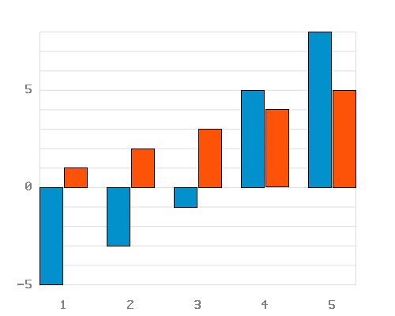
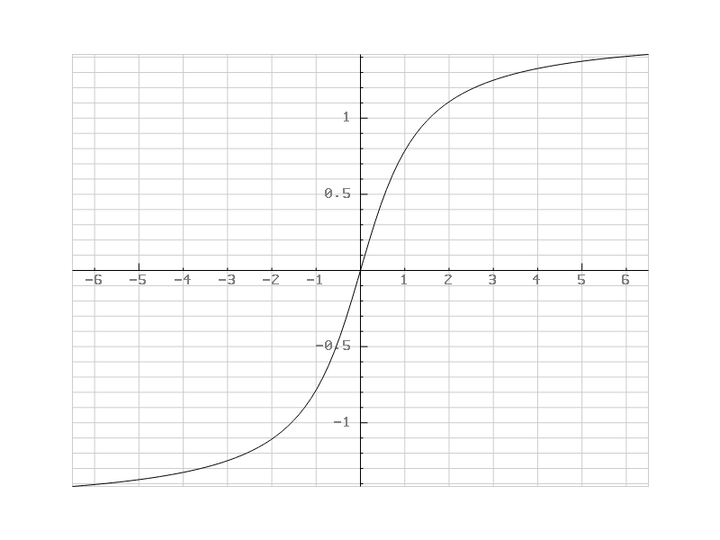
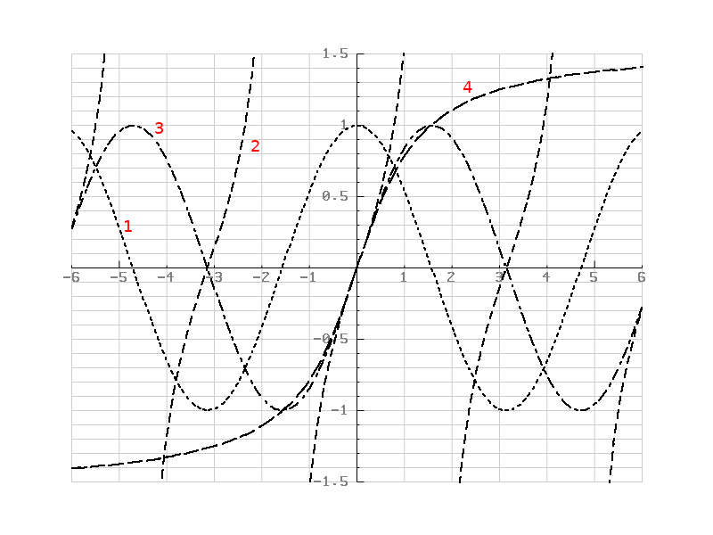
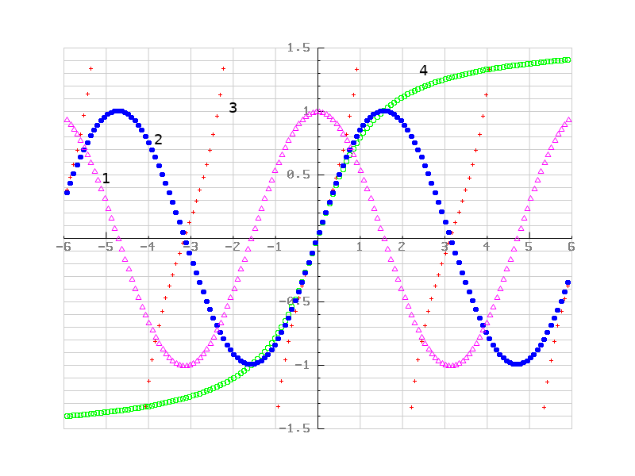
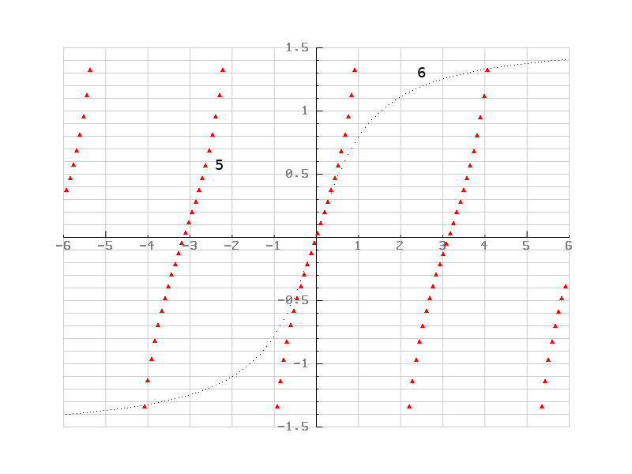
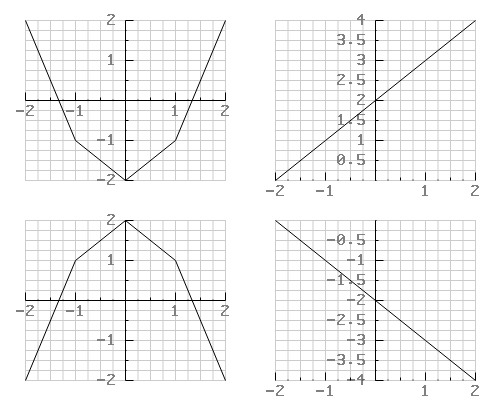
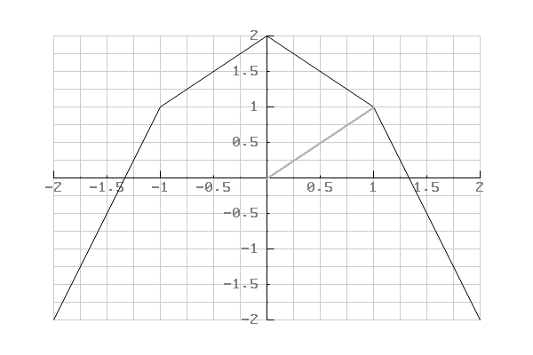

<style>

body {
  font-family: Helvetica, arial, sans-serif;
  font-size: 14px;
  line-height: 1.6;
  padding-top: 10px;
  padding-bottom: 10px;
  background-color: white;
  padding: 30px;
  color: #333;
}

body > *:first-child {
  margin-top: 0 !important;
}

body > *:last-child {
  margin-bottom: 0 !important;
}

a {
  color: #4183C4;
  text-decoration: none;
}

a.absent {
  color: #cc0000;
}

a.anchor {
  display: block;
  padding-left: 30px;
  margin-left: -30px;
  cursor: pointer;
  position: absolute;
  top: 0;
  left: 0;
  bottom: 0;
}

h1, h2, h3, h4, h5, h6 {
  margin: 20px 0 10px;
  padding: 0;
  font-weight: bold;
  -webkit-font-smoothing: antialiased;
  cursor: text;
  position: relative;
}

h2:first-child, h1:first-child, h1:first-child + h2, h3:first-child, h4:first-child, h5:first-child, h6:first-child {
  margin-top: 0;
  padding-top: 0;
}

h1:hover a.anchor, h2:hover a.anchor, h3:hover a.anchor, h4:hover a.anchor, h5:hover a.anchor, h6:hover a.anchor {
  text-decoration: none;
}

h1 tt, h1 code {
  font-size: inherit;
}

h2 tt, h2 code {
  font-size: inherit;
}

h3 tt, h3 code {
  font-size: inherit;
}

h4 tt, h4 code {
  font-size: inherit;
}

h5 tt, h5 code {
  font-size: inherit;
}

h6 tt, h6 code {
  font-size: inherit;
}

h1 {
  font-size: 28px;
  color: black;
}

h2 {
  font-size: 24px;
  border-bottom: 1px solid #cccccc;
  color: black;
}

h3 {
  font-size: 18px;
}

h4 {
  font-size: 16px;
}

h5 {
  font-size: 14px;
}

h6 {
  color: #777777;
  font-size: 14px;
}

p, blockquote, ul, ol, dl, table, pre {
  margin: 15px 0;
}

hr {
  border: 0 none;
  color: #cccccc;
  height: 4px;
  padding: 0;
}

body > h2:first-child {
  margin-top: 0;
  padding-top: 0;
}

body > h1:first-child {
  margin-top: 0;
  padding-top: 0;
}

body > h1:first-child + h2 {
  margin-top: 0;
  padding-top: 0;
}

body > h3:first-child, body > h4:first-child, body > h5:first-child, body > h6:first-child {
  margin-top: 0;
  padding-top: 0;
}

a:first-child h1, a:first-child h2, a:first-child h3, a:first-child h4, a:first-child h5, a:first-child h6 {
  margin-top: 0;
  padding-top: 0;
}

h1 p, h2 p, h3 p, h4 p, h5 p, h6 p {
  margin-top: 0;
}

li p.first {
  display: inline-block;
}

ul, ol {
  padding-left: 30px;
}

ul :first-child, ol :first-child {
  margin-top: 0;
}

ul :last-child, ol :last-child {
  margin-bottom: 0;
}

dl {
  padding: 0;
}

dl dt {
  font-size: 14px;
  font-weight: bold;
  font-style: italic;
  padding: 0;
  margin: 15px 0 5px;
}

dl dt:first-child {
  padding: 0;
}

dl dt > :first-child {
  margin-top: 0;
}

dl dt > :last-child {
  margin-bottom: 0;
}

dl dd {
  margin: 0 0 15px;
  padding: 0 15px;
}

dl dd > :first-child {
  margin-top: 0;
}

dl dd > :last-child {
  margin-bottom: 0;
}

blockquote {
  border-left: 4px solid #dddddd;
  padding: 0 15px;
  color: #777777;
}

blockquote > :first-child {
  margin-top: 0;
}

blockquote > :last-child {
  margin-bottom: 0;
}

table {
  padding: 0;
}
table tr {
  border-top: 1px solid #cccccc;
  background-color: white;
  margin: 0;
  padding: 0;
}

table tr:nth-child(2n) {
  background-color: #f8f8f8;
}

table tr th {
  font-weight: bold;
  border: 1px solid #cccccc;
  text-align: left;
  margin: 0;
  padding: 6px 13px;
}

table tr td {
  border: 1px solid #cccccc;
  text-align: left;
  margin: 0;
  padding: 6px 13px;
}

table tr th :first-child, table tr td :first-child {
  margin-top: 0;
}

table tr th :last-child, table tr td :last-child {
  margin-bottom: 0;
}

img {
  max-width: 100%;
}

span.frame {
  display: block;
  overflow: hidden;
}

span.frame > span {
  border: 1px solid #dddddd;
  display: block;
  float: left;
  overflow: hidden;
  margin: 13px 0 0;
  padding: 7px;
  width: auto;
}

span.frame span img {
  display: block;
  float: left;
}

span.frame span span {
  clear: both;
  color: #333333;
  display: block;
  padding: 5px 0 0;
}

span.align-center {
  display: block;
  overflow: hidden;
  clear: both;
}

span.align-center > span {
  display: block;
  overflow: hidden;
  margin: 13px auto 0;
  text-align: center;
}

span.align-center span img {
  margin: 0 auto;
  text-align: center;
}

span.align-right {
  display: block;
  overflow: hidden;
  clear: both;
}

span.align-right > span {
  display: block;
  overflow: hidden;
  margin: 13px 0 0;
  text-align: right;
}

span.align-right span img {
  margin: 0;
  text-align: right;
}

span.float-left {
  display: block;
  margin-right: 13px;
  overflow: hidden;
  float: left;
}

span.float-left span {
  margin: 13px 0 0;
}

span.float-right {
  display: block;
  margin-left: 13px;
  overflow: hidden;
  float: right;
}

span.float-right > span {
  display: block;
  overflow: hidden;
  margin: 13px auto 0;
  text-align: right;
}

code, tt {
  margin: 0 2px;
  padding: 0 5px;
  white-space: nowrap;
  border: 1px solid #eaeaea;
  background-color: #f8f8f8;
  border-radius: 3px;
}

pre code {
  margin: 0;
  padding: 0;
  white-space: pre;
  border: none;
  background: transparent;
}

.highlight pre {
  background-color: #f8f8f8;
  border: 1px solid #cccccc;
  font-size: 13px;
  line-height: 19px;
  overflow: auto;
  padding: 6px 10px;
  border-radius: 3px;
}

pre {
  background-color: #f8f8f8;
  border: 1px solid #cccccc;
  font-size: 13px;
  line-height: 19px;
  overflow: auto;
  padding: 6px 10px;
  border-radius: 3px;
}

pre code, pre tt {
  background-color: transparent;
  border: none;
}
</style>

# pbPlots
A plotting library available in many programming languages. Goals of this library are to 

1) Have a single library for plotting that is stable accross programming languages and over time.
2) Is easy to build in any programming language and to include in any project.
3) Is easy to use.

The library is developed using [progsbase](https://www.progsbase.com), a technology for coding timeless code in many programming languages at once.





## Download

 * [Java - 5+](Java/pbPlots/)
 * [C - 99+](C/) | [Video Tutorial](https://www.youtube.com/watch?v=I_xFjVfmRWE)
 * [C++ - 98+](Cpp/) | [Video Tutorial](https://www.youtube.com/watch?v=RNKVHQzvaRM)
 * [JavaScript - 5+](JavaScript/)
 * [TypeScript](TypeScript/)
 * [PHP - 5+](PHP/)
 * [C# - 6+](CS/)
 * [Python - 2+](Python/)
 * [Visual Basic - 9+](VisualBasic/)
 * [Ruby - 2+](Ruby/)
 
 ## Try the Library Online:
 * [Scatter Plot](https://repo.progsbase.com/repoviewer/no.inductive.libraries/Plots/latest///DrawScatterPlotFromSettings/online/)
 * [Bar Plot](https://repo.progsbase.com/repoviewer/no.inductive.libraries/Plots/latest///DrawBarPlotFromSettings/online/)

## General User Guide
The library has the same interface in all supported languages. The example below is in Java with links to complete examples in all supported programming languages.

#### Basic Usage

Complete example available in the following languages:

[Java](Java/pbPlots/Example1.java) | 
[C](C/example1.c) | 
[C++](Cpp/example1.cpp) | 
[JavaScript](JavaScript/example1.js) | 
[TypeScript](TypeScript/example1.ts) | 
[PHP](PHP/example1.php) | 
[C#](CS/Example1.cs) | 
[Python](Python/example1.py) | 
[Visual Basic](VisualBasic/example1.vb) |
[Ruby](Ruby/example1.rb)

```
RGBABitmapImageReference imageReference = CreateRGBABitmapImageReference();

double [] xs = {-2, -1, 0, 1, 2};
double [] ys = {2, -1, -2, -1, 2};

DrawScatterPlot(imageReference, 600, 400, xs, ys);
```

This code produces the following graph. The boundaries are automatically calculated. The plot is linearly interpolated and drawn in black, one pixel wide.


#### Customization of Plot

Complete example available in the following languages:

[Java](Java/pbPlots/Example2.java) | 
[C](C/example2.c) | 
[C++](Cpp/example2.cpp) | 
[JavaScript](JavaScript/example2.js) | 
[TypeScript](TypeScript/example2.ts) | 
[PHP](PHP/example2.php) | 
[C#](CS/Example2.cs) | 
[Python](Python/example2.py) | 
[Visual Basic](VisualBasic/example2.vb) |
[Ruby](Ruby/example2.rb)

```
ScatterPlotSeries series = GetDefaultScatterPlotSeriesSettings();
series.xs = new double [] {-2, -1, 0, 1, 2};
series.ys = new double [] {2, -1, -2, -1, 2};
series.linearInterpolation = true;
series.lineType = "dashed".toCharArray();
series.lineThickness = 2d;
series.color = GetGray(0.3);

ScatterPlotSettings settings = GetDefaultScatterPlotSettings();
settings.width = 600;
settings.height = 400;
settings.autoBoundaries = true;
settings.autoPadding = true;
settings.title = "x^2 - 2".toCharArray();
settings.xLabel = "X axis".toCharArray();
settings.yLabel = "Y axis".toCharArray();
settings.scatterPlotSeries = new ScatterPlotSeries [] {series};

RGBABitmapImageReference imageReference = CreateRGBABitmapImageReference();
DrawScatterPlotFromSettings(imageReference, settings);
```

This code produces the following plot. In this plot the line is changed to dashed, 2 pixels wide, light gray. A title has been added and labels for each axis.


#### Convert RGBABitmapImage to PNG

Convert to PNG and write to file:

```
double[] pngdata = ConvertToPNG(imageReference.image);
WriteToFile(pngdata, "plot.png");
DeleteImage(imageReference.image);
```

#### Line Patterns
1: "dotted", 2: "dashed", 3: "dotdash", 4: "longdash", "solid" (not shown)


#### Points
1: "triangles", 2: "dots", 3: "crosses", 4: "circles", 5: "filled triangles" (see blow), 6: "pixels" (see blow)



#### Colors
 * CreateRGBColor(red, green, blue) - where red, green, blue are the percentages (0-1) of red, green and blue.
 * CreateRGBAColor(red, green, blue, alpha) - where alpha is the percentage of opaqueness (0-1).

#### Configuration Options

ScatterPlotSettings
 * **width** - RGBABitmapImage - The width in pixels of the image with the plot.
 * **height** - RGBABitmapImage - The height in pixels of the image with the plot.
 * **title** - String - The title on the top of the plot.
 * **yLabel**, **xLabel** - String - The labels for the y and x axis, respectively.
 * **scatterPlotSeries** - (See below) - The series to plot.
 * **autoBoundaries** - boolean - If on, automatically calculate the boundaries of the plot.
 * **xMax**, **xMin**, **yMax**, **yMin** - If autoBoundaries are off, these specify the boundaries of the plot.
 * **autoPadding** - If on, automatically calculate the padding.
 * **xPadding**, **yPadding** - Number of pixels - If autoPadding is off, use these paddings.
 * **showGrid** - boolean - If on, show the grid.
 * **gridColor** - RGBA - Color of the grid, if shown.

ScatterPlotSeries

 * **linearInterpolation** - boolean - Whether to use linear interpolation to draw the plot.
 * **pointType** - String - If linearInterpolation is off, the type of point. Alternatives: "crosses", "circles", "dots", "triangles", "filled triangles", "pixels"
 * **lineType** - String - "solid", "dotted", "dashed", "dotdash", "longdash"
 * **lineThickness** - Number of pixels - Thickness of line in pixels.
 * **xs**, **ys** - Array of numbers - The x and y coordinates of points in plot.
 * **color** - RGBA - Color of the points or line.

#### Multiple Plots in Same Image

```
RGBABitmapImageReference canvasReference = CreateRGBABitmapImageReference();
RGBABitmapImage combined = CreateImage(250*2, 200*2, GetWhite());
RGBABitmapImage image1, image2, image3, image4;

double [] xs = {-2, -1, 0, 1, 2};

double [] ys1 = {2, -1, -2, -1, 2};
double [] ys2 = {-2, 1, 2, 1, -2};
double [] ys3 = {0, 1, 2, 3, 4};
double [] ys4 = {0, -1, -2, -3, -4};

DrawScatterPlot(canvasReference, 250, 200, xs, ys1);
image1 = canvasReference.image;
DrawScatterPlot(canvasReference, 250, 200, xs, ys2);
image2 = canvasReference.image;
DrawScatterPlot(canvasReference, 250, 200, xs, ys3);
image3 = canvasReference.image;
DrawScatterPlot(canvasReference, 250, 200, xs, ys4);
image4 = canvasReference.image;

DrawImageOnImage(combined, image1, 0, 0);
DrawImageOnImage(combined, image2, 0, 200);
DrawImageOnImage(combined, image3, 250, 0);
DrawImageOnImage(combined, image4, 250, 200);
```



#### Mapping from Plot Coordinates to Pixel Coordinates.
This code maps coordinates in the plot `(x, y)` to pixel coordinates on the image `(xPixels, yPixels)`. This mapping is based on the automatically generated plot settings given an image `image` and an array of numbers `xs` or `ys`.

```
xPixels = MapXCoordinateAutoSettings(xPlot, image, xs);
yPixels = MapYCoordinateAutoSettings(yPlot, image, ys);
```

When using 'DrawScatterPlotFromSettings' use 'MapXCoordinateBasedOnSettings' and 'MapYCoordinateBasedOnSettings' instead, as it will take into account all settings when mapping the coordinate.

```
xPixels = MapXCoordinateBasedOnSettings(xPlot, settings);
yPixels = MapYCoordinateBasedOnSettings(yPlot, settings);
```

#### Custom Drawing on the Plot

The following code draws a line from (0, 0) to (1, 1) in the plot's coordinate system. The coordinates must be mapped to pixel coordinates before drawing. The mapping is based on the automatic settings calculated from the image dimensions and plot data.

```
RGBABitmapImageReference canvasReference = CreateRGBABitmapImageReference();

double [] xs = {-2, -1, 0, 1, 2};
double [] ys = {-2, 1, 2, 1, -2};

DrawScatterPlot(canvasReference, 600, 400, xs, ys);

double x1 = MapXCoordinateAutoSettings(0, canvasReference.image, xs);
double y1 = MapYCoordinateAutoSettings(0, canvasReference.image, ys);

double x2 = MapXCoordinateAutoSettings(1, canvasReference.image, xs);
double y2 = MapYCoordinateAutoSettings(1, canvasReference.image, ys);

DrawLine(canvasReference.image, x1, y1, x2, y2, 2, GetGray(0.3));
```

This will produce the following plot.



Other custom drawing tools available:

 * **DrawLine** - Draws a line from point `(x1, y1)` to `(x2, y2)`.
 * **DrawPixel** - Draws a pixel on point `(x, y)`.
 * **DrawRectangle1px**, **DrawFilledRectangle** - Draws a rectangle with upper-left corner at `(x, y)` with a width `w` and heigh `h`.
 * **DrawCircle**, **DrawFilledCircle** - Draws a circle with center `(x, y)` and radius `r`.
 * **DrawTriangle**, **DrawFilledTriangle** - Draws an equilateral triangle with center `(x, y)` and distance from center to the corners `h`.
 * **DrawText** - Draws text with the upper-left point at `(x, y)`.
 * **DrawTextUpwards** - Draws text upwards with the upper-left point at `(x, y)`.
 * **DrawQuadraticBezierCurve** - Draws a quadratic Bézier curve from `(x0, y0)` to `(x1, y1)` with control point `(cx, cy)`.
 * **DrawCubicBezierCurve** - Draws a cubic Bézier curve from `(x0, y0)` to `(x1, y1)` with control points `(c0x, c0y)` and `(c1x, c1y)`.


