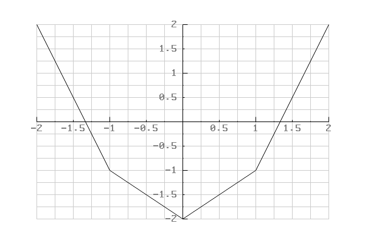
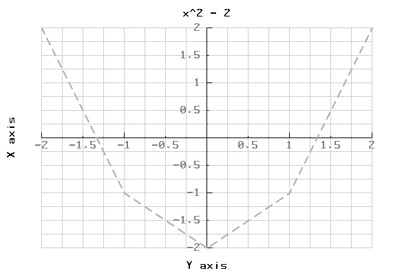

# pbPlots
A plotting library available in many programming languages. Goals of this library are to 

1) Have a single library for plotting that is stable accross programming languagues and over time.
2) Is easy to build in any programming language and to include in any project.
3) Is easy to use.

The library has been developed with using [progsbase](https://www.progsbase.com), a technology for coding timeless code in many programming languages at once.

## Download

 * [Java - Java 5+](Java/pbPlots/pbPlots.java)
 * [C - C99+ (C89 also exists)](C/pbPlots.c)


## General User Guide

## User Guide for each Language


## Java


#### Basic Usage

```
RGBABitmapImage image = CreateImage(800, 600, GetWhite());

double [] xs = {-2, -1, 0, 1, 2};
double [] ys = {2, -1, -2, -1, 2};

DrawScatterPlot(image, xs, ys);
```

Draws:



#### Advanced Usage

```
ScatterPlotSeries series = GetDefaultScatterPlotSeriesSettings();
series.xs = new double [] {-2, -1, 0, 1, 2};
series.ys = new double [] {2, -1, -2, -1, 2};
series.linearInterpolation = true;
series.lineType = "dashed".toCharArray();
series.lineThickness = 2d;
series.color = GetGray(0.3);

ScatterPlotSettings settings = GetDefaultScatterPlotSettings();
settings.canvas = CreateImage(800, 600, GetWhite());
settings.autoBoundaries = true;
settings.autoPadding = true;
settings.title = "x^2 - 2".toCharArray();
settings.xLabel = "X axis".toCharArray();
settings.yLabel = "Y axis".toCharArray();
settings.scatterPlotSeries = new ScatterPlotSeries [] {series};

DrawScatterPlotFromSettings(settings);
```

Draws:



#### Convert RGBABitmapImage to PNG

Convert to PNG and write to file:

```
double[] pngdata = ConvertToPNG(image);
WriteToFile(pngdata, "plot.png");
DeleteImage(image);
```


