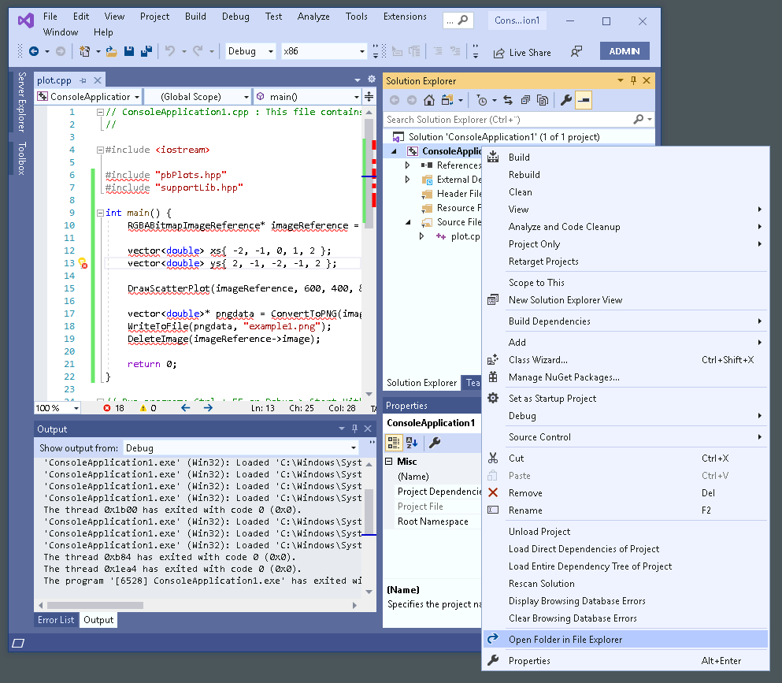
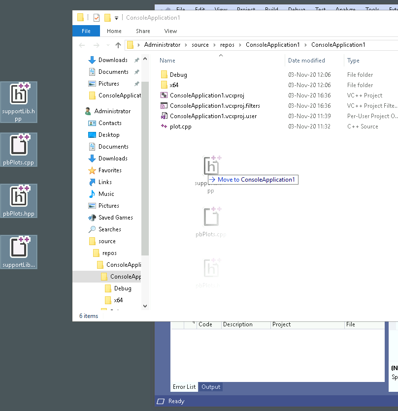
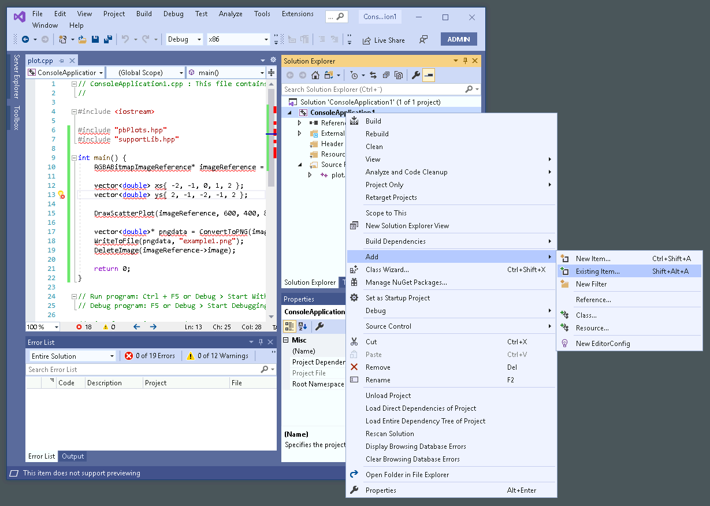
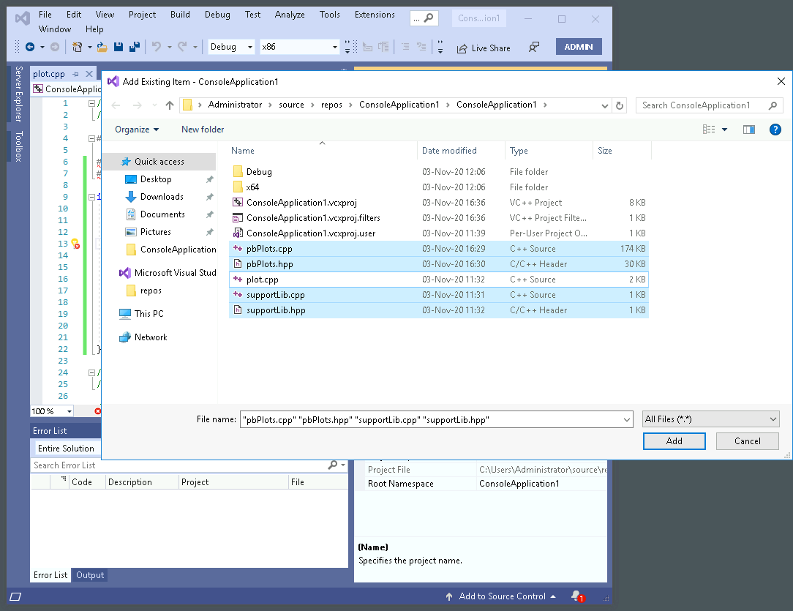
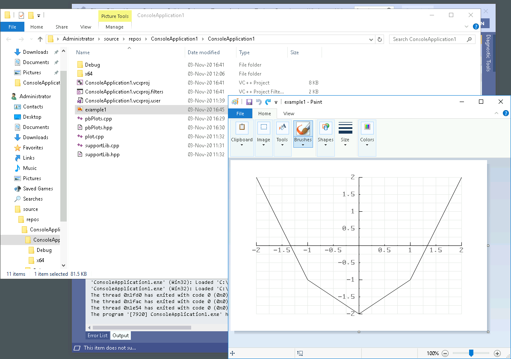

Download pbPlots.cpp, pbPlots.hpp, supportLib.cpp, supportLib.hpp from version [pbPlots 0.1.7.3](https://github.com/InductiveComputerScience/pbPlots/tree/v0.1.7.3).

Right-click on the project name and press "Open folder in file explorer".

Select then drag and drop the files into the folder.

Right-click on the project name, go into "Add" press "Existing item...".

Select the four files in the project folder.

The program should now compile successfully. Copy the code from example1.cpp to produce a plot.

Good luck!